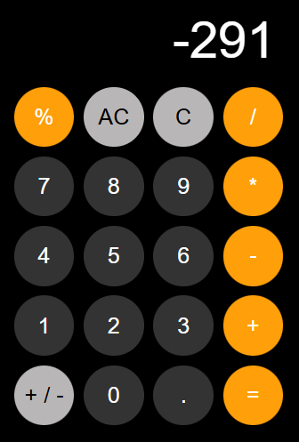

# 🧮 Calculator App

> An interactive, responsive web-based calculator that allows users to perform basic  arithmetic operations with a sleek, modern user interface.

---

## 📌 Problem Statement

Many digital calculators are either cluttered with unnecessary functions or lack a responsive, mobile-friendly design. This Calculator App solves this by providing a clean, distraction-free interface that focuses on speed, accuracy, and a seamless user experience for everyday mathematical calculations.

---

## 🎯 Project Goals

- Enable users to execute standard arithmetic operations (+, -, *, /) dynamically in real-time.
- Support advanced operations such as percentages, decimal inputs, and positive/negative toggles
- Deliver an ultra-fast browsing experience with zero lag using optimized  and pure JavaScript.

---

## 🛠️ Tech Stack

**Technologies Used:**
- **HTML5:** For semantic page structuring and rendering the calculator display and button layout.
- **CSS3:** For a modern responsive design similar to an Iphone calculator
- **JavaScript:** For managing mathematical logic, handling button click events and executing DOM update and error handling.

## 🖥 Features

- **Instant Calculations:**  Executes mathematical logic instantly without page reloads.
- **Clear & Delete Operations**  Features AC (All Clear) to reset the state and a backspace/delete option for correcting mistakes.
- **Decimal Precision:**  Handles decimal operations seamlessly while preventing multiple consecutive decimal points.

---

## 📷 Screenshots

---

## ⚙️ Installation & Setup

To clone and run this project locally, execute the following commands in your terminal:

~~~bash
# Clone the repository
git clone https://github.com/RusselFonta/Calculators.git

# Navigate into the project directory
cd calculator

# Switch Branch to feature/Calculator if your are on the main branch
git checkout feature/Calculator
~~~

---

## 🧠 Challenges Faced

- **Preventing Syntax Errors:** Implementing logic checks to prevent users from typing consecutive operators (e.g., ++ or */)
- **Floating-Point Precision:** Fixing standard JavaScript math bugs (like 0.1 + 0.2 = 0.30000000000000004) using precision formatting tools like .toFixed()
- **Handling UI Timing:** Ensuring long numbers dynamically scale down or scroll instead of breaking the CSS container layout.
- **Error handling:** Implementing logic checks to handle mathematical error and invalide operation(infinity , isNAN, -infinity...)

---

## 📚 What I Learned

- **State Tracking:** Managing global variables to track the current input, previous input, and the active mathematical operator
- **Error handling:** Using try and catch to trap any error produced and improve error analysis by looking at the code and and thinking about the possible error that will occur.
- **Handling UI Timing:** Ensuring long number dynamically scale down instead of breaking the CSS container layout.

---

## 🚀 Future Improvements

- **Calculation History:**  Add a sliding panel that saves a history of recent calculations using localStorage
- **Scientific Mode:**  Include a toggle to reveal advanced functions like square roots, exponents, and trigonometric functions (sin, cos, tan)
- **Dark/Light Mode:** Implement a theme switch using CSS variables and local state.

---

## 👨🏽‍💻 Author

**Russel Fonta Fadil**
*Junior Fullstack Developer*

- 📩 **Email:** fontawestbrook99@gmail.com
- 🌍 **Location:** Cameroon (Open to remote opportunities)
- 💼 **GitHub:** [RusselFonta](https://github.com/RusselFonta)